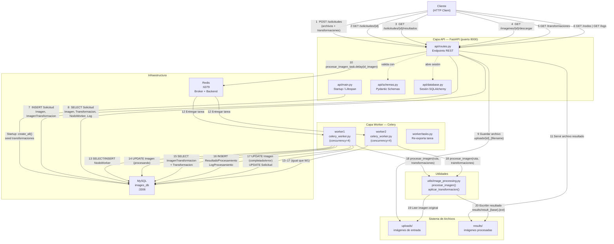
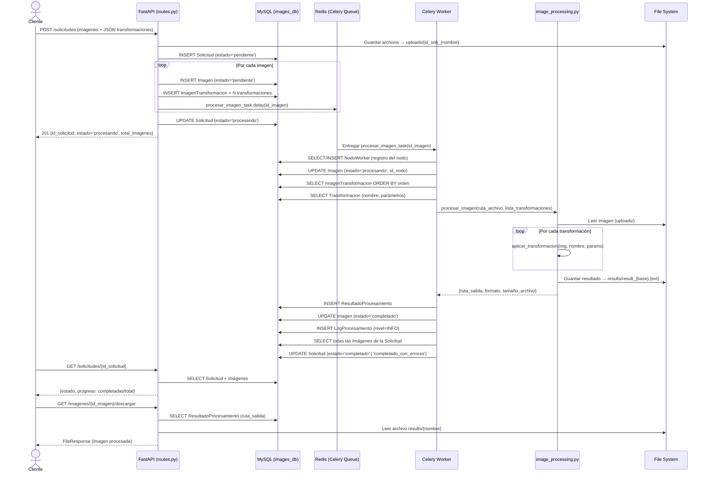
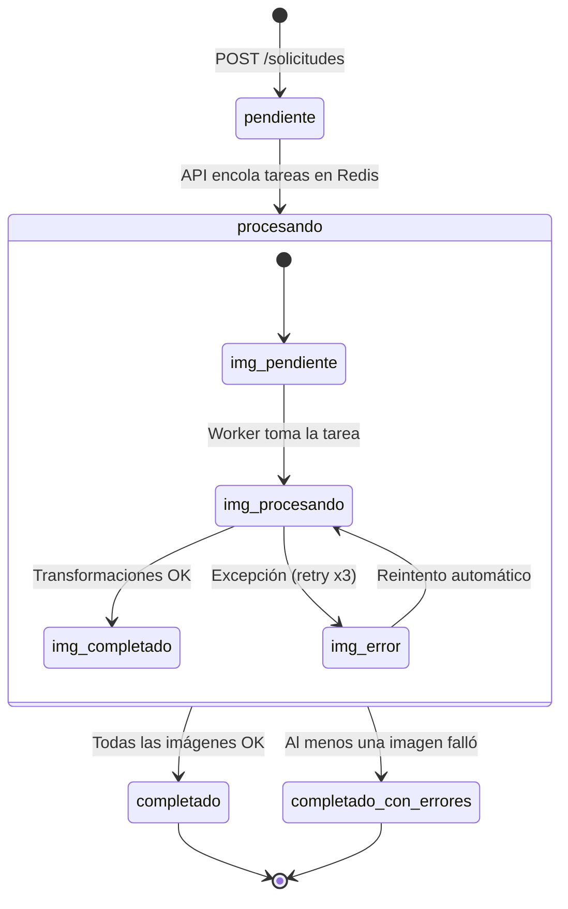

# Diagrama de Comunicación — Image Processing System

## 1. Diagrama de Componentes y Mensajes

---

## 2. Diagrama de Secuencia — Flujo Principal

---

## 3. Tabla de Mensajes entre Componentes

| # | Emisor | Receptor | Mensaje / Operación | Protocolo |
|---|--------|----------|---------------------|-----------|
| 1–6 | Cliente | API Routes | Peticiones HTTP REST | HTTP/1.1 |
| 7 | API Routes | MySQL | INSERT/SELECT ORM (Solicitud, Imagen, etc.) | SQLAlchemy/PyMySQL |
| 8 | API Routes | File System | Guardar archivos subidos | OS I/O |
| 9 | API Routes | Redis | `procesar_imagen_task.delay(id_imagen)` | Celery/Redis protocol |
| 10 | API Routes | File System | Servir archivo resultado | OS I/O |
| 11 | Redis | Celery Worker | Entregar tarea serializada (JSON) | Celery wire format |
| 12 | Celery Worker | MySQL | SELECT/UPDATE Imagen, NodoWorker, Logs | SQLAlchemy/PyMySQL |
| 13 | Celery Worker | image_processing | `procesar_imagen(ruta, transformaciones)` | Llamada directa Python |
| 14 | image_processing | File System | Leer/escribir imágenes con PIL | PIL/OS I/O |
| 15 | Celery Worker | Redis | Resultado de tarea (éxito/error) | Celery result backend |

---

## 4. Ciclo de Estados de una Solicitud

